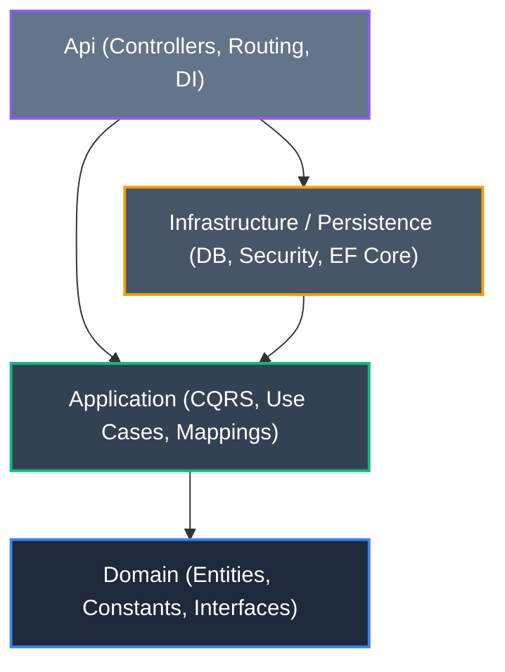
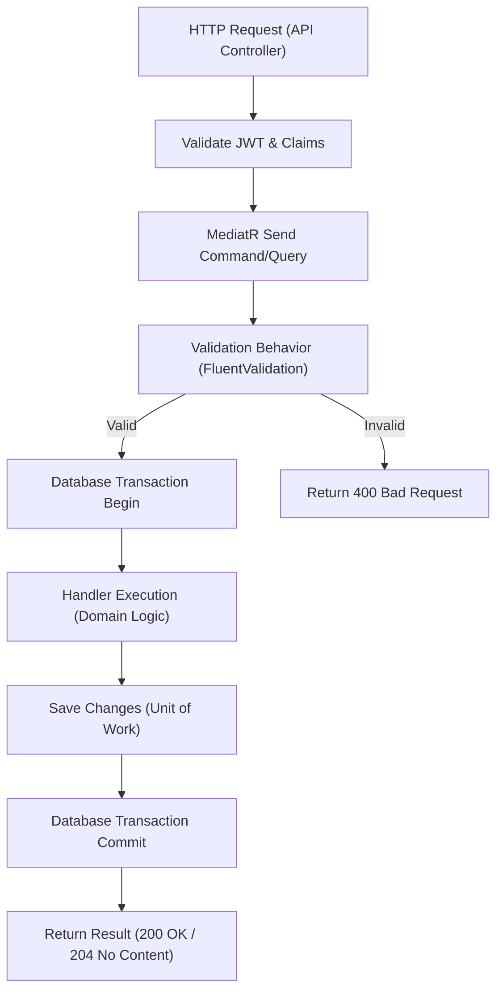
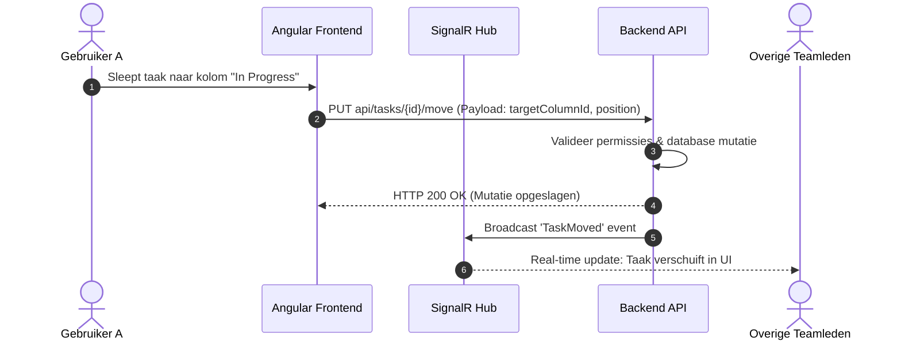
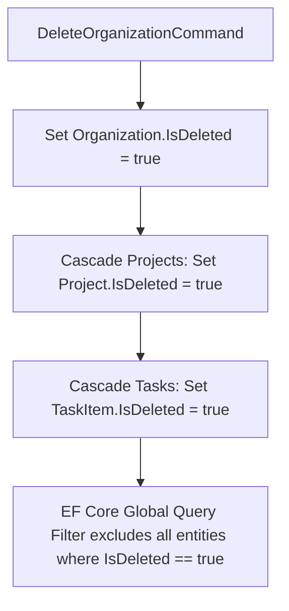

# Flira — Enterprise Project Management Platform

Flira is een moderne enterprise projectmanagementapplicatie ontworpen voor teams die projecten, taken en real-time samenwerking centraal willen organiseren. Het combineert de visuele eenvoud van Kanban-boards met de procesdiepte en configureerbaarheid van Jira. 

Het project is gebouwd als een robuuste, schaalbare full-stack applicatie en dient als een technische showcase voor Clean Architecture, CQRS, en moderne frontend-state-management.

---

## Inhoudsopgave

1. [Over het Project](#1-over-het-project)
2. [Technische Stack](#2-technische-stack)
   - [Backend](#backend)
   - [Frontend](#frontend)
   - [DevOps & Database](#devops--database)
3. [Architectuur & Design Patterns](#3-architectuur--design-patterns) *(Binnenkort)*
4. [Process & State Flows](#4-process--state-flows) *(Binnenkort)*
5. [Testing & Kwaliteit](#5-testing--kwaliteit) *(Binnenkort)*
6. [Installatie & Opstarten](#6-installatie--opstarten) *(Binnenkort)*

---

## 1. Over het Project

Flira ondersteunt teams bij het stroomlijnen van hun dagelijkse werkzaamheden. De belangrijkste functionele peilers van het platform zijn:

* **Multi-tenant data-isolatie:** Gebruikers kunnen lid zijn van meerdere organisaties en teams, met strikte scheiding van data.
* **Flexibel Project- & Boardbeheer:** Projecten bevatten dynamische Kanban-boards met drag-and-drop functionaliteit voor taken.
* **Real-time updates:** Dankzij SignalR-integratie worden board-wijzigingen en notificaties direct naar alle actieve teamleden gepusht.
* **Uitgebreide Taakdetails:** Taken ondersteunen toewijzingen, prioriteiten, deadlines, labels, bestandsuploads en opgemaakte reacties (Markdown) met `@mentions`.
* **Dashboard & Rapportage:** Ingebouwde widgets voor burndown charts, team velocity, open taken en een kalenderweergave.
* **Enterprise Security & Audit:** Rollen- en permissiebeheer (RBAC), JWT authenticatie met refresh tokens en audit logging voor alle kritieke administratieve mutaties.

---

## 2. Technische Stack

Het project maakt gebruik van moderne, stabiele frameworks en libraries in een volledig gecontaineriseerde omgeving.

### Backend
* **Framework:** .NET 10.0 (ASP.NET Core Web API)
* **Architectuur:** Clean Architecture (Domain-Driven Design principes)
* **CQRS-Patroon:** MediatR voor in-memory dispatching van Commands en Queries
* **Validatie & Mapping:** FluentValidation en AutoMapper
* **Database Access:** Entity Framework Core (Code-First)
* **Beveiliging:** ASP.NET Core Identity & JWT Bearer Authentication
* **Logging:** Serilog (gestructureerde logging naar console en bestanden)
* **API Documentatie:** Swashbuckle / OpenAPI (Swagger)

### Frontend
* **Framework:** Angular 22+ (Strict Mode)
* **UI Componenten:** Angular Material & Angular CDK (met Tailwind CSS of custom SCSS variabelen voor dark mode)
* **State Management:** NgRx Signal Store
* **Internationalisatie:** ngx-translate (meertalige ondersteuning)
* **Visualisaties:** Chart.js

### DevOps & Database
* **Database:** PostgreSQL
* **Containerisatie:** Docker & Docker Compose (API, Frontend & Database)
* **CI/CD:** GitHub Actions (Build, Lint & Test Pipelines)

---
## 3. Architectuur & Design Patterns

Flira is opgebouwd volgens de principes van **Domain-Driven Design (DDD)** en **Clean Architecture**. Dit scheidt de kern-bedrijfslogica van externe invloeden zoals databases, frameworks en UI-componenten.



### Lagenstructuur
1. **Domain:** Bevat de pure bedrijfsentiteiten (bijv. `Organization`, `Project`, `TaskItem`), value objects en kerninterfaces. Deze laag heeft nul externe dependencies.
2. **Application:** Bevat de use-cases van het systeem, CQRS handlers, validators en mappings. Deze laag refereert enkel naar de Domain-laag.
3. **Persistence / Infrastructure:** Implementeert interfaces uit de Application-laag (bijv. `FliraDbContext`, `PermissionService`). Bevat de EF Core configuratie en database-migraties.
4. **Api:** Het startpunt van de backend. Verantwoordelijk voor HTTP routing, request/response-validatie en dependency injection.

### Belangrijke Design Patterns
* **CQRS (Command Query Responsibility Segregation):** Scheiding van schrijfoperaties (Commands) en leesoperaties (Queries) met behulp van **MediatR**. Dit optimaliseert performantie en maakt business-operaties transparant.
* **Pipeline Behaviors:** MediatR-behaviors worden gebruikt voor cross-cutting concerns zoals automatische request-validatie via **FluentValidation** en transactiebeheer.
* **Repository & Unit of Work:** Entity Framework's `DbContext` fungeert direct als de Unit of Work, en `DbSet<T>` als de repositories om onnodige abstractielagen te vermijden.
* **Role-Based Access Control (RBAC):** Permissies (bijv. `Organization.MembersManage`) zijn gekoppeld aan rollen (`Owner`, `Admin`, `Member`) via een gecentraliseerde `PermissionService`.

---

## 4. Process & State Flows

### CQRS Request-Pipeline
Wanneer een API-aanroep binnenkomt, doorloopt het request de volgende stappen:



### Drag-and-Drop Column/Task State Transition
Wanneer een gebruiker een taak naar een andere kolom sleept, wordt de verplaatsing direct verwerkt en real-time gesynchroniseerd via SignalR:



### Soft-Delete Cascade Flow
Bij het verwijderen van een organisatie door de `Owner` wordt een soft-delete uitgevoerd om dataverlies te voorkomen:



---

## 5. Testing & Kwaliteit

Flira hanteert een strikte kwaliteitsstandaard met geautomatiseerde tests.

### Backend Testing (xUnit)
1. **Unit Tests (`Flira.Application.UnitTests`):**
   * Testen van command handlers, queries en domeinvalidatie.
   * Externe dependencies (zoals repositories of DB-contexten) worden gemockt via **NSubstitute** of in-memory datastores.
   
2. **Integration Tests (`Flira.Api.IntegrationTests`):**
   * Validatie van controllers en de database-integratie.
   * Maakt gebruik van **Testcontainers** om lokaal en in CI/CD een PostgreSQL-container te starten, zodat tests tegen een échte database draaien.

### Frontend Kwaliteit
* **Vitest:** Moderne, snelle unit testing voor Angular componenten en state-stores.
* **Strict TypeScript:** Null-checks en type-safety zijn volledig ingeschakeld.
* **Prettier & Linting:** Automatische opmaakcontrole voor consistente code-indeling.

---

## 6. Installatie & Opstarten

### Vereisten
* **Docker Desktop** (aanbevolen)
* **.NET 10 SDK** (voor handmatige opstart)
* **Node.js 22+ & npm** (voor handmatige opstart)

### Optie A: Volledige start via Docker Compose (Aanbevolen)
Dit start de database, de Web API en de Angular-applicatie in geïsoleerde containers.

1. Kloon de repository:
   ```bash
   git clone https://github.com/Nithiann/Flira.git
   cd Flira
   ```
2. Start de applicatie:
   ```bash
   docker-compose up --build -d
   ```
3. Open de applicatie in de browser:
   * **Frontend:** [http://localhost:4200](http://localhost:4200)
   * **Backend Swagger/API Docs:** [http://localhost:8080/swagger](http://localhost:8080/swagger)

### Optie B: Handmatige start (voor development)

#### 1. Database opstarten
Start een lokale PostgreSQL container op:
```bash
docker run --name flira_postgres -e POSTGRES_PASSWORD=postgres -e POSTGRES_DB=flira_db -p 5432:5432 -d postgres:15-alpine
```

#### 2. Backend opstarten
1. Navigeer naar de backend folder:
   ```bash
   cd backend/src/Flira.Api
   ```
2. Voer de EF database migraties uit:
   ```bash
   dotnet ef database update
   ```
3. Start de Web API:
   ```bash
   dotnet run
   ```
   *De API draait nu op [http://localhost:8080](http://localhost:8080)*

#### 3. Frontend opstarten
1. Open een nieuwe terminal en navigeer naar de frontend folder:
   ```bash
   cd frontend
   ```
2. Installeer dependencies:
   ```bash
   npm install
   ```
3. Start de Angular development server:
   ```bash
   npm start
   ```
   *De applicatie is nu bereikbaar op [http://localhost:4200](http://localhost:4200)*
